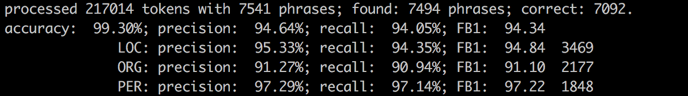
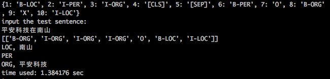
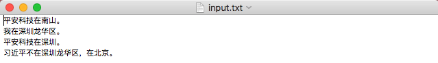
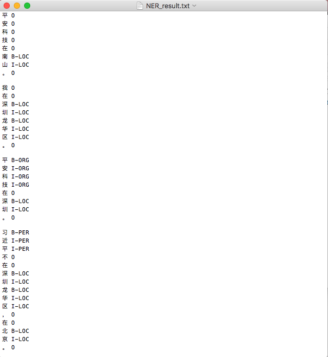

# BERT-CRF-NER
##参考Github地址

参考github项目: https://github.com/macanv/BERT-BiLSTM-CRF-NER

###################################################################


##模型结构BERT+CRF Decoder

* 代码文件`bert_base/train/models.py` line101: 设置参数**crf_only=True**，控制模型只使用CRF进行解码(如果设置**crf_only=False**，模型将使用**BiLSTM-CRF作为Decoder**)

  


## 模型训练

* **模型&训练参数**需要在代码文件`bert_base/train/train_helper.py`手动修改

* 如果在上诉代码文件中设置**crf_only=True**，则train_helper.py中关于BiLSTM的参数都不会被用到

* 调整好参数以后，直接在命令行cd到`BERT-BiLSTM-CRF-NER/`下运行以下指令(**由于代码中写的是相对路径，因此必须在BERT-BiLSTM-CRF-NER/目录下运行**)

  ```
  python run.py
  ```

  (**注: 由于借不到GPU，所以训练在本机运行训练2500 step后我就停止了训练。耗时24h**)


## 数据集介绍

* 数据来源: SIGHAN Bakeoff2006(**仅仅只是部分数据**)

* 获取途径: https://github.com/zjy-ucas/ChineseNER/tree/master/data

* 语料情况(数据集所含句子数):

  | 训练集 | 开发集 | 测试集 |
  | ------ | ------ | ------ |
  | 20,846 | 2,318  | 4,636  |

  语料示例:

  ```
  海 O
  钓 O
  比 O
  赛 O
  地 O
  点 O
  在 O
  厦 B-LOC
  门 I-LOC
  与 O
  金 B-LOC
  门 I-LOC
  之 O
  间 O
  的 O
  海 O
  域 O
  。 O
  ```

  

## 测试集表现

所有参数都是用default值(除了训练**batch_size**下降为32)

* 原github作者模型表现:
  
  * 测试集表现
  
    

- 自行实验模型表现:

  - 测试集表现

    


## 终端预测
* 模型训练到一定步数后，就会在输出路径下生成model.checkpoint文件；此时即能进行终端预测，直接运行以下指令即可

```angular2html
python terminal_predict.py
```



##批量预测

* 根据macanv在github中提供的`terminal_predict.py`写了一个批量预测脚本`batch_predict.py`

* 使用: 需要将待预测文本存储在名为`input.txt`的txt文件中(每一句要预测的句子为一行)，放置在与`batch_predict.py`相同目录下; 修改`batch_predict.py`文件中的**model_dir** **bert_dir**; 最后运行以下指令:

  ```
  python batch_predict.py
  ```

  `input.txt`示例:
  
  
  
  运行结束后，会在同目录下生成`NER_result.txt`，示例:
  
  


## 原文档+标注文件合并为BIO格式文件

原文档标注后转BIO格式文档的函数放在`Label_to_BIO/label_text_BIO.py`文件里，在学校实验室，标注文档格式如label.txt所示。有可能跟贵公司的标注文件格式不同，如果有其他要求，可以随时联系我。


## 参考资料: 
+ https://github.com/guillaumegenthial/tf_metrics/blob/master/tf_metrics/__init__.py
+ [https://github.com/google-research/bert](https://github.com/google-research/bert)
+ [https://github.com/kyzhouhzau/BERT-NER](https://github.com/kyzhouhzau/BERT-NER)
+ [https://github.com/zjy-ucas/ChineseNER](https://github.com/zjy-ucas/ChineseNER)
+ [https://github.com/hanxiao/bert-as-service](https://github.com/hanxiao/bert-as-service)
+ https://github.com/macanv/BERT-BiLSTM-CRF-NER